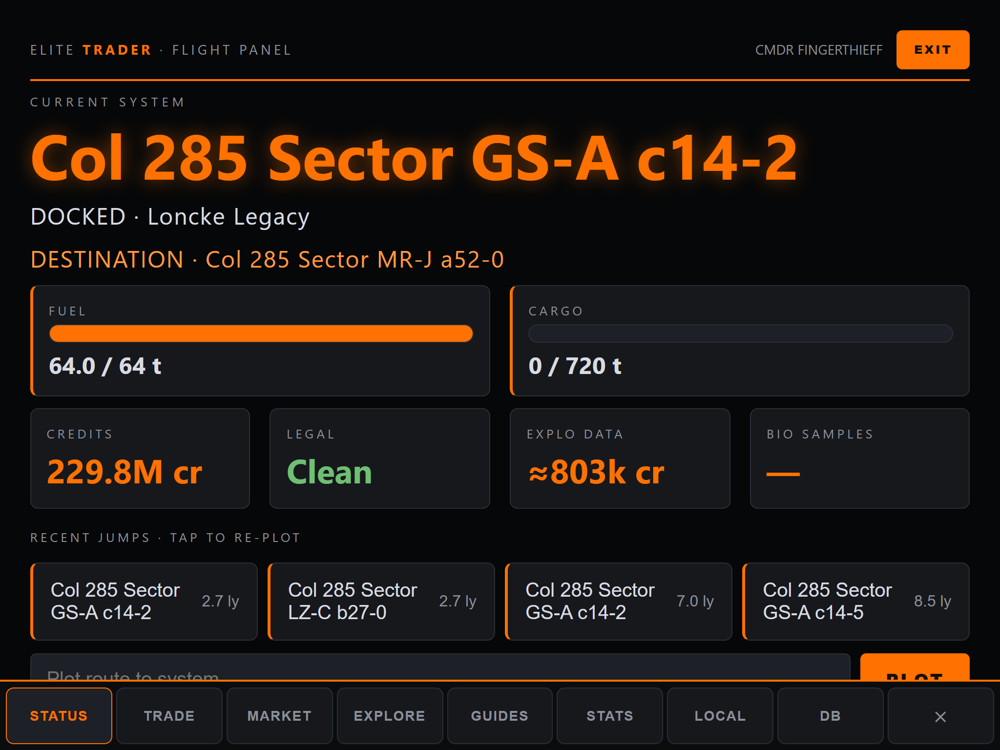

<div align="center">


**The all-in-one Elite Dangerous companion.** *(formerly Elite Trader)*
Live journal reading · a local 36-million-price market database · profit-per-hour
trade routes · exploration, exobiology, combat, engineering & background-sim
tools · local mission planning and specialist consoles · a paired tablet cockpit
mode · route plotting inside the game itself.


> **Disclaimer:** this codebase was **AI-generated with Claude (Fable 5)**,
> directed and play-tested by me against my own live game. It's a personal
> project built for my own use — shared as-is, and anyone is welcome to use it.

[**Download**](../../releases) · [**Demo video**](https://tannermidd.github.io/frameshift/) · [**Wiki**](../../wiki) · [**Getting Started**](../../wiki/Getting-Started) · [**Troubleshooting**](../../wiki/Troubleshooting-and-FAQ)


</div>

> Runs on your machine, serves every screen to any device on your home network.
> No account, sign-in or API key is required. It also plays nicely alongside
> EDMC — keep that running if you use it to sync Inara/EDSM. o7

## ❤️ Built on the community

This app is a consumer of Elite Dangerous' open-data ecosystem. Not one route,
price or bio signal in it would be possible without these projects — and the
thousands of commanders feeding them:

- **[EDDN](https://github.com/EDCD/EDDN)** · *Elite Dangerous Data Network* —
  the community's live data relay. Every fresh price here exists because
  another commander docked somewhere and their tool reported it. Frameshift
  **contributes markets back anonymously by default**. A separate, default-off
  informed opt-in can also publish outfitting, shipyards, navigation,
  exploration, Codex and biological-signal observations using EDDN's public
  schemas. Reports use reviewed field allowlists and are stamped with your game
  version so consumers can keep Live and Legacy data separate.
- **[Spansh](https://spansh.co.uk)** — the backbone of the app's data. The
  daily galaxy dump seeds the 36-million-price local database; the route APIs
  power the neutron plotter, Road to Riches and the exobiology route; the
  per-system dumps provide station facts, services and the community-mapped
  bio signals you see before you honk; the station search finds material
  traders, modules and ships.
- **[Inara](https://inara.cz)** — the encyclopedia of the galaxy. Pre-filled
  search links throughout the app, and the engineering and shipyard references
  the guides point to.
- **[EDSM](https://www.edsm.net)** — system data and mapping links wherever a
  system name appears.
- **[EDCD](https://edcd.github.io/)** — the community developer collective
  whose schemas, journal documentation and conventions make it possible for
  tools like this one to interoperate at all.

If you find these sites useful, support them — most run on donations.
Not affiliated with Frontier Developments. Elite Dangerous is a trademark of
Frontier Developments plc.

## What it does

### 💹 Trade — [wiki](../../wiki/Trade-Routes-and-Market-Tools)

- **Trade loops & multi-hop chains** ranked by **profit/hour**, computed locally against live prices — stock/demand shown, thin stock flagged.
- **Market confidence** — price age, available stock/demand and bulk-sale risk are combined into an honest confidence band and conservative profit range; positioning time is included in the first-trip rate.
- **WATCH alerts** — every EDDN update is checked against your active loop; price drops or drained demand alert you *before* a wasted trip. Watches survive restarts.
- **Cargo recovery** — if a watched market falls through, re-plan the hold against nearby alternatives without including the failed station.
- **Commodity search** (best buy/sell near you), **WHERE TO SELL?** for your current hold, **mining advisor** with nearest ring hotspots, **outfitting/shipyard search**.
- **System stations viewer** — every station in any system: pads, economy, faction, services, and its full EDDN-fresh market table.
- **Price history sparklines** for stations you visit or watch.

### 🧬 Explore & exobiology — [wiki](../../wiki/Exploration-and-Exobiology)

- **Bio signals** for the current system — with genuses **other commanders already mapped** (via Spansh) shown before you even honk, and predictions where nobody has.
- **Sampling navigator** — a live on-surface distance readout against the genus's colony range, with a spoken "clear to sample" when you've walked far enough from every previous sample.
- **Surface navigator** — a north-up, body-local map of your position and heading, journal samples and persistent manual pins, exportable as GeoJSON.
- **Exobiology route** ("Billionaire's Boulevard") from your position, **filterable by genus**; sampling progress + unsold-samples vault with Vista Genomics values, including **★ likely first-log detection** (the 5× bonus, predicted from body discovery state + community data).
- **Where to sell your data** — the deep-space "get me home": nearest ports with Universal Cartographics & Vista Genomics (fleet carriers flagged), with jump estimates at your range. A **data-at-risk guard** warns (and speaks) when your unsold pile is worth many rebuys.
- **Road to Riches**, **neutron plotter**, unsold cartographic value tracker, and **◈ TRACK** progress banners that auto-advance as you jump.

### ⚔️ Combat & missions

- **Massacre stack tracker** — per-target-faction progress with the correct math (kills count for every giver at once), payouts, and a callout when the stack completes.
- **Combat / AX console** — session kills, bounties, bonds, damage and synthesis usage, plus a journal-backed AX loadout/readiness checklist with clearly labelled last-observed ammunition.
- Session kills, bounty & bond claims; **mission board** with expiry countdowns, cargo-match warnings and live **delivery progress** (wing missions included); **colonization depot** needs and sourcing.
- **Interstellar Factors finder** — the nearest stations that clear your bounties and fines, one tap from plotting.
- **Rebuy safety net** — amber below 2× rebuy, red when you can't cover one, spoken warning as you cross each line.

### 🔧 Engineering — a dedicated page

- **Engineer tracker** — everyone you've unlocked (grade pips), been invited by, or heard of; specialties, home systems, one-tap plotting.
- **Complete offline workshop** — the bundled catalog covers ship engineering, experimentals, synthesis, engineer and technology unlocks, and Odyssey upgrades/modifications; it needs no runtime download or account.
- **Shared wishlist** — plan multiple upgrades against one inventory, with exact grade/application costs, source guidance, deficits, **material-trader conversion math**, nearest traders, and a callout when the list completes.
- **Odyssey locker** — on-foot goods/assets/data for bartenders and suit engineering (auto-hidden on Horizons).
- **Your current ship in a builder** — open the live loadout in EDSY or copy SLEF for Coriolis/Inara; **jumponium readiness** (FSD-injection counts), echoed in fuel-strand warnings.

### ⚑ Galaxy — Powerplay, factions & community goals

- **Powerplay 2.0 tracker** — your pledge, rating and merits (with a live session tally), plus every system's power status as you jump: controlling power, control progress, reinforcement vs undermining.
- **System factions (BGS)** — influence bars, active/pending/recovering states, controlling faction and **your reputation** with each, refreshed on every jump.
- **Conflicts** — wars and elections in the system: who's fighting, what's staked, days won.
- **Community goals** — the ones you've signed up for: your contribution, reward tier, percentile band and expiry countdown.
- New-player friendly: every card explains its corner of the background sim when it's empty.

### ◎ OPS — local mission control

- **Session planner** — give Frameshift a time budget and it ranks personal objectives and known work by urgency, value, risk and dependencies using timings learned from your own journal.
- **Durable objectives** — keep commander-specific goals, estimates, deadlines and locations alongside automatically derived work.
- **Operations boards** — coordinate objectives, assignments, resource reservations and contributions by exporting and importing a deterministic JSON file. Merges retain visible conflicts; there is no hosted service or account.

### ▦ Specialist workflows

- **Mining runs** — journal-counted refinery yield, prospector quality, limpets, conservative sale attribution, yield rate and per-commander history.
- **Combat / AX sessions** — readiness, claims, kills by type, damage, synthesis and durable session history.
- **Fleet-carrier planning** — upkeep runway, tritium coverage by explicit route leg, cargo, owner-observed market orders and buy-order exposure without inventing values the journal does not provide.
- **Exobiology fieldwork** — body-local surface pins, sample-clearance guidance, heading and GeoJSON export.

### 🖥️ Cockpit — [wiki](../../wiki/Flight-Panel-Mode)

- **Flight panel**: the default view — a touch-first cockpit display for a mounted tablet, with a nav rail, a persistent status strip, swipe navigation, one-tap best-loop and optional fullscreen. (✕ EXIT switches to the classic desktop layout.)
- **Voice callouts** for what actually matters: *fuel-scoop warnings along your plotted route* (never strand in a dry stretch again), interdictions, hull damage, first discoveries, rebuy coverage, data-at-risk, waypoints. A human-sounding **neural voice** (Piper TTS, synthesized locally) is the default once its one-time download is done — six voices to pick from, volume and sizing dials in Settings.
- **Game launch control** — when Elite isn't running, the panel says so and a ▲ LAUNCH button starts it on your PC (works from the tablet).
- **Make it yours** — drag cards to reorder any page, **hide the ones you don't use**, and pick a **color theme** (six presets or any custom accent) to match your in-game HUD; all saved per device, so the tablet stays lean while the desktop shows everything.
- **Fleet at a glance** — stored ships (location, value, transfer cost) and a **fleet-carrier panel** (tritium, balance, scheduled jump) that only appears if you own one.
- **Autoplot (Windows)** — ◎ plots the route in the game itself using your own keybinds, verified against `NavRoute.json`. [wiki](../../wiki/Autoplot)

### 📈 Analytics

- Live session (credits/hr, jumps, distance, tons), **earnings by source** (trade, missions, bounties, exploration, exobiology), balance-over-time and daily-profit charts, top commodities.
- A compressed local event ledger preserves commander history for lifetime queries, learned timings and future rebuilds of derived features without sending journals anywhere.

<div align="center"></div>

## Quick start

**Windows (no Python):** grab [`Frameshift.exe`](../../releases) and run it.
It keeps data in `data\` next to itself and **auto-updates** (release notes
readable in-app before applying).

**From source (Windows):**
```
git clone https://github.com/TannerMidd/frameshift
cd frameshift
run.bat
```

**Linux / Steam Deck:** `./run.sh --headless`, then open the printed URL in a
browser. Proton journals are auto-detected. [Details →](../../wiki/Getting-Started)

Then:
1. **Play** — journal detection is automatic (relocated Saved Games included);
   if anything's off, **Settings → Journal folder** validates as you type.
2. **⚙ Settings → Build Database** (once, ~15 min) — every station market in
   the galaxy, then kept fresh in real time by EDDN; a first-run banner
   points you there. [How it works →](../../wiki/Market-Database)
3. **Pair a tablet** — open **⚙ Settings → Paired Devices** on the gaming PC
   and scan the one-time QR code (or open its LAN link). No password or account
   is needed; that device reconnects automatically afterwards and starts in the
   flight panel. Tap **⛶ FULL** for fullscreen.

## Good to know

- **Configuration** lives in the app (Settings card); env vars for the rest — [reference](../../wiki/Settings-and-Configuration).
- **Autoplot** needs keyboard binds for the galaxy map / UI navigation — [requirements](../../wiki/Autoplot).
- **Security**: localhost access on the gaming PC is automatic. Every LAN device must use a short-lived, single-use pairing link and receives a revocable **read**, **control** or **admin** capability. Requests are also protected against cross-site, DNS-rebinding and oversized-input attacks. Keep Frameshift on a trusted LAN and do not port-forward it.
- **Commander data** lives in the separate `data/commander.db`; the disposable market cache can be rebuilt without replacing history, watches, objectives or specialist records. Frameshift switches profiles automatically and isolates the same commander name in Live and Legacy.
- **Live / Legacy**: anonymous community route and market tools are Live-galaxy data and fail closed while Legacy is running, rather than showing plausible but wrong advice. Local journal history and specialist tools remain available in the isolated Legacy profile.
- **Online services**: community data uses public, anonymous EDDN and Spansh endpoints. No integration asks for a login or API key; the engineering catalog, journal history, planning and specialist tools are local.
- **Diagnostics & extensions**: Settings can create a bounded, privacy-safe local support bundle that excludes journals, commander names, pairing secrets and databases. Permissioned declarative extension packs can add journal-driven alerts or objective suggestions; see [Extension API v1](docs/EXTENSIONS.md).
- **Releases** (maintainer): push a `v*` tag; GitHub Actions tests on Windows and Linux, builds and smoke-tests the packaged app, publishes SHA-256 sidecars and releases the exe under both `Frameshift.exe` and the legacy `EliteTrader.exe` name. The updater uses that same-release checksum to detect corruption or truncation (it is not an independent publisher signature) and retains the rollback through a sustained healthy launch and a later successful startup.
- Something broken? [Troubleshooting & FAQ](../../wiki/Troubleshooting-and-FAQ).
