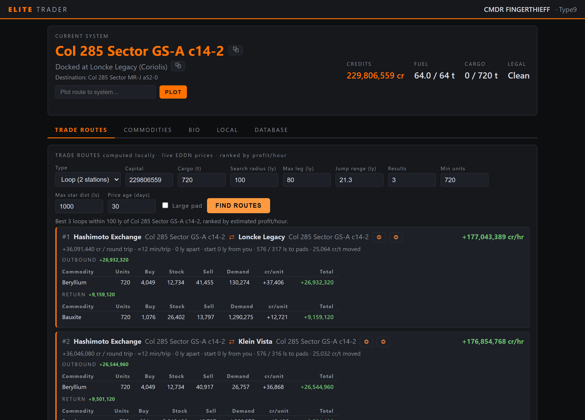
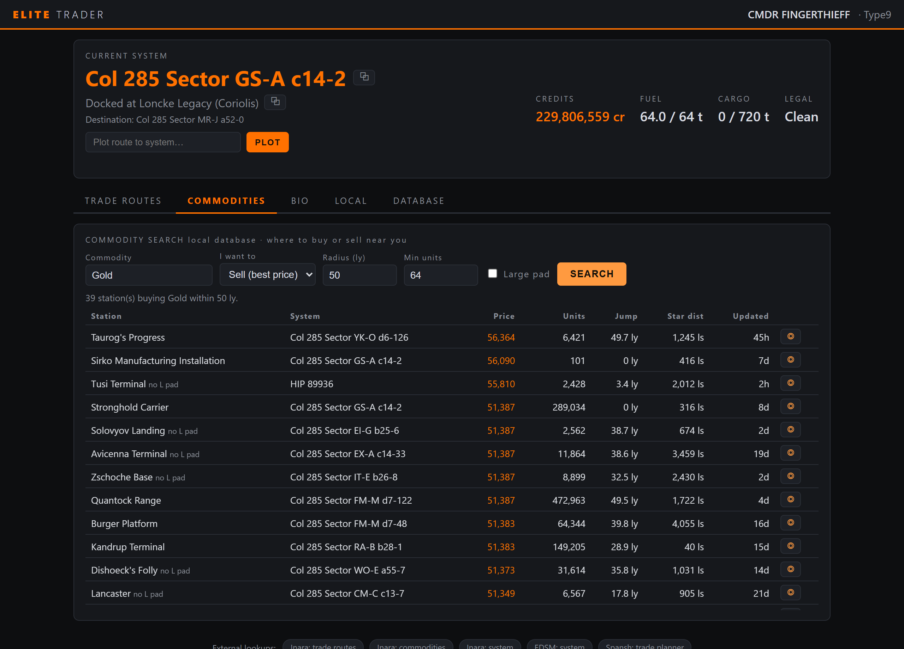
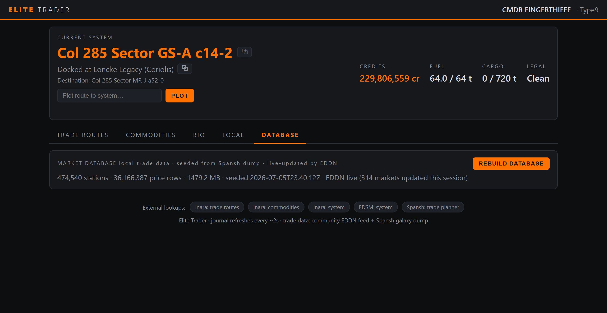
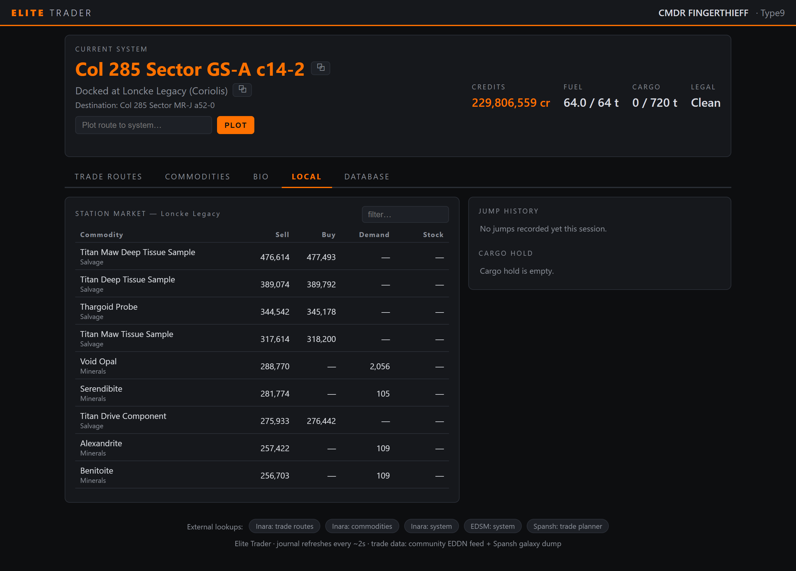

<div align="center">

# ELITE TRADER

**Your own trade computer for Elite Dangerous.**

Reads the game's journal live · builds its own 36-million-price market database from
the same open data Inara & Spansh use · finds profit-per-hour trade loops · plots
routes directly in the in-game galaxy map · serves every screen to your phone or
tablet over your home network.


> **Disclaimer:** this codebase was AI-generated with **Claude (Fable 5)**, directed
> and play-tested by me against my own live game. It's a personal project built for
> my own use — shared as-is, and anyone is welcome to use it.



</div>

## What it does

### 🔁 Trade loops, ranked by profit per hour

Inara-style two-station round trips computed **on your machine** against live
prices. Each loop shows cr/hr, cr/trip, minutes per trip, and a full commodity
breakdown — units, buy/sell, **station stock and demand** (thin stock flagged red),
and profit per unit. A loop several jumps away outranks a mediocre one next door,
because relocating is a one-time cost. Search radius, leg length, jump range,
minimum stock and result count are all configurable and persist between sessions.
A multi-hop chain mode is included too.

### 🔍 Commodity search

Where to buy or sell anything near you — best price first, with distance, units
available, pad size and price age. One click plots the route in game.

<div align="center"></div>

### 🎯 Autoplot (Windows)

Click ◎ next to any system anywhere in the app: Elite Trader focuses the game,
opens the galaxy map with your own keybinds, types the system into search and
plots the route — then **verifies it actually worked** against the game's
`NavRoute.json` instead of hoping.

### 📡 A market database that stays fresh

One click downloads Spansh's daily galaxy dump (~4 GB, deleted after import) into
a ~1.5 GB SQLite database: **474k station markets, 36M prices**. From then on the
community **EDDN** live feed updates prices in real time — when any player in the
galaxy docks, your database knows the new prices within seconds.

<div align="center"></div>

### 🧬 Exobiology

The **Bio** tab tracks your exobiology run: biological signals on every scanned
body in the current system (with genus value ranges and the **sample-spacing
distance** you must travel between the three samples), your live sampling
progress, and the unsold samples you're carrying with their estimated Vista
Genomics payout — so you always know how many credits are riding on not
crashing. First footfall pays 5× on top.

### 🚀 Live ship & local data

Current system, station, credits, fuel, cargo and legal state ~2 s behind the
game; the docked station's full market table; jump history and cargo hold — plus
copy buttons everywhere and pre-filled Inara/EDSM/Spansh links in the footer.

<div align="center"></div>

---

## Quick start (Windows)

Requires Python 3.10+.

```
git clone <this repo>
cd elite-trader
run.bat
```

`run.bat` creates a virtual environment, installs dependencies and starts the app.
The desktop window opens; the LAN URL (e.g. `http://192.168.1.65:8666`) is printed
at startup for other devices. `run.bat --headless` runs the server without a window.

Allow the Windows Firewall prompt on **Private networks** if you want LAN access.

Prefer no Python at all? Grab **`EliteTrader.exe`** from the
[Releases](../../releases) page, or build it yourself with `build_exe.bat`.
The exe keeps its database in a `data\` folder next to itself.

## Quick start (Linux / Steam Deck)

The game runs under Steam Proton; the app runs natively with Python 3.10+:

```
git clone <this repo>
cd elite-trader
chmod +x run.sh
./run.sh --headless
```

Then open the printed URL in any browser (same machine or LAN). Notes:

- **Journals and bindings are auto-detected** inside the Proton prefix
  (`~/.local/share/Steam/steamapps/compatdata/359320/pfx/...` and the `~/.steam`
  variants). If your Steam library lives elsewhere, point `ED_JOURNAL_DIR` at the
  journal folder inside the prefix.
- **Headless + browser is the recommended mode.** The desktop window works too,
  but pywebview needs GTK/WebKit system packages
  (e.g. Debian/Ubuntu: `sudo apt install python3-gi gir1.2-gtk-3.0 gir1.2-webkit2-4.1`).
- **Autoplot is Windows-only for now** (it injects keystrokes into the game
  client); the plot buttons report this cleanly on Linux. Everything else works
  fully.

## First run: build the market database

Open the **Database** tab and click **Build Database** once:

1. Downloads Spansh's daily galaxy dump (~4 GB, deleted after import).
2. Imports every station market into `data/market.db` (~15 minutes).
3. The EDDN live feed keeps it fresh in real time while the app runs.

Until then, trade routes fall back to the Spansh API. Rebuild any time from the
same button.

## Autoplot requirements

Autoplot drives the game with emulated keystrokes using your own key bindings.
These actions need **keyboard** keys bound (controller-only binds won't work):
*Galaxy Map*, *UI Up*, *UI Down*, *UI Right*, *UI Select*, *UI Back*. Leave the
game untouched for the ~15 s a plot takes. Timing constants live at the top of
`elite/autoplot.py`; plotting to the system you're already in always fails (the
game refuses it).

## Configuration

| Env var          | Meaning                          | Default |
|------------------|----------------------------------|---------|
| `ET_PORT`        | HTTP port                        | `8666`  |
| `ET_DATA_DIR`    | Database folder                  | `data/` next to the app |
| `ED_JOURNAL_DIR` | Journal folder override          | auto-detected (Windows / Proton) |
| `ED_BINDINGS_DIR`| Key bindings folder override     | auto-detected (Windows / Proton) |
| `ED_PLOT_KEY`    | Autoplot hold-key override       | `UI_Select` bind, then Enter |

## Releases

To cut a release (maintainer): tag and push — GitHub Actions builds the exe,
smoke-tests it and publishes the release with the exe attached:

```
git tag v1.0.0
git push origin v1.0.0
```

## Security note

The web server has **no authentication** — anyone on your network can see your
in-game location and credits. Fine on a home LAN; do **not** port-forward it to
the internet.

## Data sources & credits

- **[EDDN](https://github.com/EDCD/EDDN)** — the community's live market data
  relay; this app is a consumer.
- **[Spansh](https://spansh.co.uk)** — daily galaxy dumps used to seed the
  database, and the fallback route API.
- Links to **[Inara](https://inara.cz)** and **[EDSM](https://www.edsm.net)**.
- Not affiliated with Frontier Developments. Elite Dangerous is a trademark of
  Frontier Developments plc.
